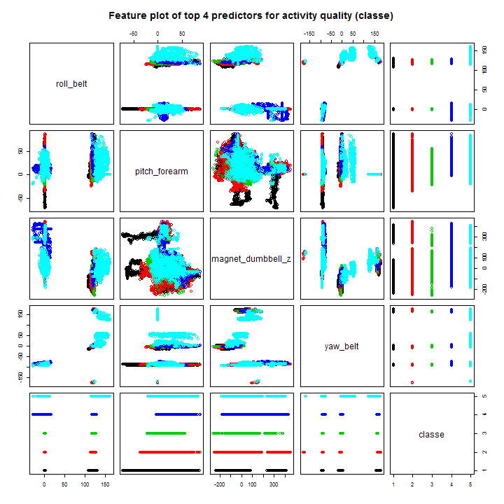
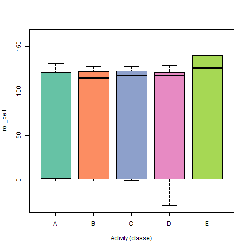
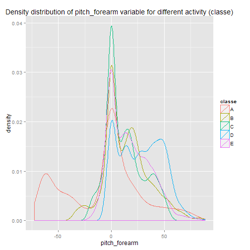
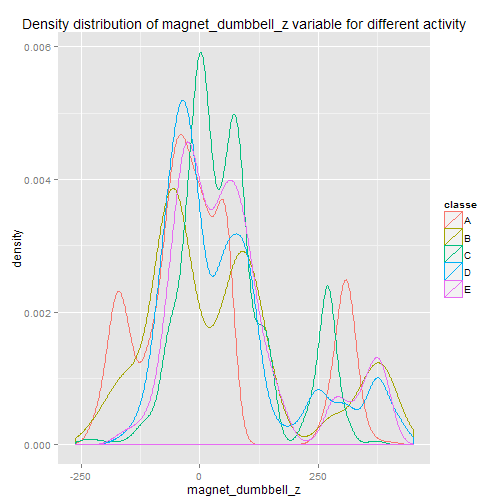

Using Data from Accelerometers to Predict the Correct Way of Doing Exercises
========================================================

## Synopsis

Using personal sport devices it is now possible to collect a large amount of 
data about personal activity relatively inexpensively. One thing that people 
regularly do is quantify how much of a particular activity they do, but they 
rarely quantify how well they do it. In this project, we will study how to 
predict if a barbell lifted correctly or incorrectly using data from 
accelerometers on the belt, forearm, arm, and dumbell of 6 participants, that
were asked to perform in 5 different ways. 
The dataset was kindly provided by [Groupware@LES](http://groupware.les.inf.puc-rio.br/har).

## Data Processing

### Download and read the data


```r
if (!file.exists("training.csv")) {
    download.file("http://d396qusza40orc.cloudfront.net/predmachlearn/pml-training.csv", 
        "training.csv", mode = "wb")
}
if (!file.exists("testing.csv")) {
    download.file("http://d396qusza40orc.cloudfront.net/predmachlearn/pml-testing.csv", 
        "testing.csv", mode = "wb")
}
training <- read.csv("training.csv")
to_submit <- read.csv("testing.csv")
head(training[1:5])
```

```
##   X user_name raw_timestamp_part_1 raw_timestamp_part_2   cvtd_timestamp
## 1 1  carlitos           1323084231               788290 05/12/2011 11:23
## 2 2  carlitos           1323084231               808298 05/12/2011 11:23
## 3 3  carlitos           1323084231               820366 05/12/2011 11:23
## 4 4  carlitos           1323084232               120339 05/12/2011 11:23
## 5 5  carlitos           1323084232               196328 05/12/2011 11:23
## 6 6  carlitos           1323084232               304277 05/12/2011 11:23
```


### Modify data

Some variables in this dataset are very sparse and contain mainly NA's. These
were excluded from feather analysis by removing them from training dataset 
if they contains only NA's in "to_submit" dataset.


```r
mask <- sapply(to_submit, function(x) {
    all(is.na(x))
})
training <- training[, !mask]
```


We also removed all variables, that are unnecessary to analysis, and might
bring a bias to prediction model, like names of sportsmens, and time of 
measurements.


```r
training <- training[8:dim(training)[2]]
```


After that we splitted the dataset on three parts: training, testing, and stacked 
model validation sets.


```r
inTrain <- createDataPartition(y = training$classe, p = 0.7, list = FALSE)
testing <- training[-inTrain, ]
training <- training[inTrain, ]

inTrain <- createDataPartition(y = training$classe, p = 0.8, list = FALSE)
validation <- training[-inTrain, ]
training <- training[inTrain, ]
```


In the next step we analysed training dataset for co-varince of predictors.
As we can see, there are many high-correlated predictors in the dataset:


```r
M <- abs(cor(training[, -53]))
diag(M) <- 0
which(M > 0.8, arr.ind = TRUE)
```

```
##                  row col
## yaw_belt           3   1
## total_accel_belt   4   1
## accel_belt_y       9   1
## accel_belt_z      10   1
## accel_belt_x       8   2
## magnet_belt_x     11   2
## roll_belt          1   3
## roll_belt          1   4
## accel_belt_y       9   4
## accel_belt_z      10   4
## pitch_belt         2   8
## magnet_belt_x     11   8
## roll_belt          1   9
## total_accel_belt   4   9
## accel_belt_z      10   9
## roll_belt          1  10
## total_accel_belt   4  10
## accel_belt_y       9  10
## pitch_belt         2  11
## accel_belt_x       8  11
## gyros_arm_y       19  18
## gyros_arm_x       18  19
## magnet_arm_x      24  21
## accel_arm_x       21  24
## magnet_arm_z      26  25
## magnet_arm_y      25  26
## accel_dumbbell_x  34  28
## accel_dumbbell_z  36  29
## gyros_dumbbell_z  33  31
## gyros_forearm_y   45  31
## gyros_forearm_z   46  31
## gyros_dumbbell_x  31  33
## gyros_forearm_y   45  33
## gyros_forearm_z   46  33
## pitch_dumbbell    28  34
## yaw_dumbbell      29  36
## gyros_dumbbell_x  31  45
## gyros_dumbbell_z  33  45
## gyros_forearm_z   46  45
## gyros_dumbbell_x  31  46
## gyros_dumbbell_z  33  46
## gyros_forearm_y   45  46
```


So we reduced the number of predictors by using the variable importance analysis 
on object obtained by training. We used only variables with overall importance 
higher than 5 in futher analysis (31 predictors).


```r
rf_train_sample_indexes <- sample(dim(training)[1], size = 1000, replace = FALSE)
rf_train_sample <- training[rf_train_sample_indexes, ]

rf_model <- train(classe ~ ., method = "rf", data = rf_train_sample)
importance <- varImp(rf_model)
importance
```

```
## rf variable importance
## 
##   only 20 most important variables shown (out of 52)
## 
##                      Overall
## roll_belt             100.00
## pitch_forearm          58.47
## magnet_dumbbell_z      52.83
## roll_forearm           38.20
## magnet_dumbbell_y      36.18
## yaw_belt               34.62
## roll_dumbbell          30.03
## pitch_belt             28.24
## accel_forearm_x        20.34
## magnet_dumbbell_x      19.01
## magnet_arm_x           15.67
## magnet_belt_z          15.17
## accel_dumbbell_y       13.67
## magnet_belt_y          12.87
## yaw_arm                11.20
## accel_belt_z           10.39
## accel_dumbbell_z        9.55
## yaw_dumbbell            8.94
## magnet_arm_y            8.82
## total_accel_dumbbell    8.58
```

```r
sum(importance$importance$Overall > 5)
```

```
## [1] 31
```

```r

classe <- training$classe
training <- training[, importance$importance$Overall > 5]
training$classe <- classe
```


## Results

### Predictor plotting

As we can see, the most important features for predictions are roll_belt, 
pitch_forearm, magnet_dumbbell_z and yaw_belt. Let exemine them in more details.
At first, we can look at them together at feature plot, where every different 
color coresponds to each "classe" to predict:


```r
plot(training[, c("roll_belt", "pitch_forearm", "magnet_dumbbell_z", "yaw_belt", 
    "classe")], col = training$classe, main = "Feature plot of top 4 predictors for activity quality (classe)")
```

 


We can already see at feature plot some diferences in variable's distribution 
for 5 different activities. Also we can plot the most important features 
individually:


```r
library(RColorBrewer)
col <- brewer.pal(5, name = "Set2")
boxplot(roll_belt ~ classe, data = training, col = col, xlab = "Activity (classe)", 
    ylab = "roll_belt")
```

 


At this boxplot we can see different distribution of roll_belt variable for "A" 
and "E" activities, comparing to "B", "C", and "D". Also we can see major 
differences in density distribution for the next two variables:


```r
qplot(pitch_forearm, col = classe, data = training, geom = "density", main = "Density distribution of pitch_forearm variable for different activity (classe)")
```

 

```r
qplot(magnet_dumbbell_z, col = classe, data = training, geom = "density", main = "Density distribution of magnet_dumbbell_z variable for different activity")
```

 


As we can see, there are a lot of different nonoverlapping spikes of density on 
graph for different activities, which makes them good predictors.  

### Machine learning

We used three different models to predict activity quality from activity monitors 
in testing set: random forest, linear discriminant analysis and support vector machine. 
In order to increase overall sensitivity was used model stacking and new
predictors from these models were used to train stacked model, which was tested 
on validation dataset.

Cross validation was used for model train control (method="cv").


```r
lda_model <- train(classe ~ ., method = "lda", data = training, trControl = trainControl(method = "cv"))
pred_lda <- predict(lda_model, testing)
lda_result <- confusionMatrix(pred_lda, testing$classe)


svm_fit <- svm(classe ~ ., data = training)
pred_svm <- predict(svm_fit, testing)
svm_result <- confusionMatrix(pred_svm, testing$classe)


rf_train_sample_indexes <- sample(dim(training)[1], size = 3000, replace = FALSE)
rf_train_sample <- training[rf_train_sample_indexes, ]
rf_model <- train(classe ~ ., method = "rf", data = rf_train_sample, trControl = trainControl(method = "cv"))
pred_rf <- predict(rf_model, testing)
rf_result <- confusionMatrix(pred_rf, testing$classe)
```


The highest accuracy in prediction of activity quality on separate model 
was obtained using random forest method:  


```r
rf_result
```

```
## Confusion Matrix and Statistics
## 
##           Reference
## Prediction    A    B    C    D    E
##          A 1659   26    0    0    0
##          B   12 1064   39    0    4
##          C    2   41  971   23    9
##          D    0    4   16  941   11
##          E    1    4    0    0 1058
## 
## Overall Statistics
##                                         
##                Accuracy : 0.967         
##                  95% CI : (0.963, 0.972)
##     No Information Rate : 0.284         
##     P-Value [Acc > NIR] : <2e-16        
##                                         
##                   Kappa : 0.959         
##  Mcnemar's Test P-Value : NA            
## 
## Statistics by Class:
## 
##                      Class: A Class: B Class: C Class: D Class: E
## Sensitivity             0.991    0.934    0.946    0.976    0.978
## Specificity             0.994    0.988    0.985    0.994    0.999
## Pos Pred Value          0.985    0.951    0.928    0.968    0.995
## Neg Pred Value          0.996    0.984    0.989    0.995    0.995
## Prevalence              0.284    0.194    0.174    0.164    0.184
## Detection Rate          0.282    0.181    0.165    0.160    0.180
## Detection Prevalence    0.286    0.190    0.178    0.165    0.181
## Balanced Accuracy       0.992    0.961    0.965    0.985    0.988
```


Little smaller accuracy was for support vector machine method:


```r
svm_result
```

```
## Confusion Matrix and Statistics
## 
##           Reference
## Prediction    A    B    C    D    E
##          A 1631   93    5    2    0
##          B    9  949   44    8    4
##          C    7   86  937   85   35
##          D   25    2   30  869   35
##          E    2    9   10    0 1008
## 
## Overall Statistics
##                                         
##                Accuracy : 0.917         
##                  95% CI : (0.909, 0.924)
##     No Information Rate : 0.284         
##     P-Value [Acc > NIR] : <2e-16        
##                                         
##                   Kappa : 0.894         
##  Mcnemar's Test P-Value : <2e-16        
## 
## Statistics by Class:
## 
##                      Class: A Class: B Class: C Class: D Class: E
## Sensitivity             0.974    0.833    0.913    0.901    0.932
## Specificity             0.976    0.986    0.956    0.981    0.996
## Pos Pred Value          0.942    0.936    0.815    0.904    0.980
## Neg Pred Value          0.990    0.961    0.981    0.981    0.985
## Prevalence              0.284    0.194    0.174    0.164    0.184
## Detection Rate          0.277    0.161    0.159    0.148    0.171
## Detection Prevalence    0.294    0.172    0.195    0.163    0.175
## Balanced Accuracy       0.975    0.910    0.935    0.941    0.964
```


And the lowest accuracy was for linear determinant analysis:


```r
lda_result
```

```
## Confusion Matrix and Statistics
## 
##           Reference
## Prediction    A    B    C    D    E
##          A 1312  201   96   63   50
##          B   68  659   70   83  179
##          C  120  156  702   99  119
##          D  160   44  129  662  119
##          E   14   79   29   57  615
## 
## Overall Statistics
##                                         
##                Accuracy : 0.671         
##                  95% CI : (0.659, 0.683)
##     No Information Rate : 0.284         
##     P-Value [Acc > NIR] : <2e-16        
##                                         
##                   Kappa : 0.584         
##  Mcnemar's Test P-Value : <2e-16        
## 
## Statistics by Class:
## 
##                      Class: A Class: B Class: C Class: D Class: E
## Sensitivity             0.784    0.579    0.684    0.687    0.568
## Specificity             0.903    0.916    0.898    0.908    0.963
## Pos Pred Value          0.762    0.622    0.587    0.594    0.775
## Neg Pred Value          0.913    0.901    0.931    0.937    0.908
## Prevalence              0.284    0.194    0.174    0.164    0.184
## Detection Rate          0.223    0.112    0.119    0.112    0.105
## Detection Prevalence    0.293    0.180    0.203    0.189    0.135
## Balanced Accuracy       0.843    0.747    0.791    0.797    0.766
```


We created stacked model trained with results of previous models as predictors.
We used random forest method with cross validation for this purpose. 


```r
predDF <- data.frame(rf = pred_rf, svm = pred_svm, lda = pred_lda, classe = testing$classe)
stackMod <- train(classe ~ ., method = "rf", trControl = trainControl(method = "cv"), 
    data = predDF)
```


Then, after training stacked model on testing dataset, we tested it on validation
dataset:


```r
predV_lda <- predict(lda_model, validation)
predV_svm <- predict(svm_fit, validation)
predV_rf <- predict(rf_model, validation)
predVDF <- data.frame(rf = predV_rf, svm = predV_svm, lda = predV_lda, classe = validation$classe)
stackPred <- predict(stackMod, predVDF)
confusionMatrix(stackPred, validation$classe)
```

```
## Confusion Matrix and Statistics
## 
##           Reference
## Prediction   A   B   C   D   E
##          A 777  14   0   0   0
##          B   4 498  19   0   4
##          C   0  17 455  10   1
##          D   0   1   5 439   1
##          E   0   1   0   1 499
## 
## Overall Statistics
##                                         
##                Accuracy : 0.972         
##                  95% CI : (0.965, 0.977)
##     No Information Rate : 0.284         
##     P-Value [Acc > NIR] : <2e-16        
##                                         
##                   Kappa : 0.964         
##  Mcnemar's Test P-Value : NA            
## 
## Statistics by Class:
## 
##                      Class: A Class: B Class: C Class: D Class: E
## Sensitivity             0.995    0.938    0.950    0.976    0.988
## Specificity             0.993    0.988    0.988    0.997    0.999
## Pos Pred Value          0.982    0.949    0.942    0.984    0.996
## Neg Pred Value          0.998    0.985    0.989    0.995    0.997
## Prevalence              0.284    0.193    0.174    0.164    0.184
## Detection Rate          0.283    0.181    0.166    0.160    0.182
## Detection Prevalence    0.288    0.191    0.176    0.162    0.182
## Balanced Accuracy       0.994    0.963    0.969    0.986    0.994
```


As result, we obtained higher overall accuracy of prediction, than using three 
previous training models on their own, with 95% CI from 0.965 to 0.977, and best 
accuracy estimate of 0.972.


## References

Velloso, E.; Bulling, A.; Gellersen, H.; Ugulino, W.; Fuks, H. Qualitative Activity Recognition of Weight Lifting Exercises. Proceedings of 4th International Conference in Cooperation with SIGCHI (Augmented Human '13) . Stuttgart, Germany: ACM SIGCHI, 2013.
